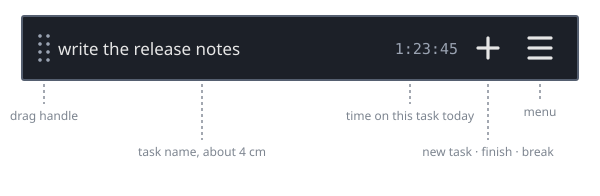

# WipTracker


A one-line, always-on-top bar that shows the task you are focused on right now.

Everything else you are juggling sits on a stack underneath it. Time is only collected for
the task on top, so the numbers at the end of the day describe where your attention
actually went — not how long a ticket was open.




| Where       | Click      | Hold                                  |
| ----------- | ---------- | ------------------------------------- |
| drag handle | —          | drag to move (frameless windows only) |
| task name   | rename     | 2 seconds: finish it, or end a break  |
| fork        | task stack | take a break                          |
| `+`         | new task   | put a finished task back              |
| `≡`         | menu       | daily timer                           |

Left button only — no right click, no middle click, no double click, so a trackpad or a
touchscreen can reach everything. While you hold, the control fills up to show how far the
hold has come; letting go early does the click instead. Every hold is also an entry in the
menu, because a touchscreen never shows a tooltip.

Hovering a control opens a small window beside the bar explaining it, and while you hold
one that window shows the reading cat filling up. It has to be a window of its own: the bar
is 32 pixels tall, and a tooltip cannot be drawn outside the window it belongs to.

## Install

Download the archive for your platform from the
[latest release](https://github.com/paxel/wipTracker/releases/latest).

**Linux** — `brew install paxel/tap/wiptracker` works here too and needs nothing further.
Otherwise install the `.deb`, which registers the icon and the desktop entry:

```sh
sudo dpkg -i wiptracker_*_amd64.deb
```

Or unpack the tarball and register the desktop files yourself — without them Wayland shows
no taskbar icon:

```sh
tar -xzf wiptracker-*-linux-x86_64.tar.gz
./install-icon.sh
./wiptracker
```

**Windows** — unpack the zip and run `wiptracker.exe`.

**macOS** — open the `.dmg` (one universal build, Apple Silicon and Intel) and move
`WipTracker.app` to `/Applications`. The build is not
signed with an Apple Developer certificate, so Gatekeeper will refuse it on first launch
("WipTracker is damaged"). Clear the quarantine flag once:

```sh
xattr -cr /Applications/WipTracker.app
```

Or use a package manager — each release pushes a formula and a manifest.

**Homebrew**, on macOS *and* Linux, which also installs the desktop entry and icon:

```sh
brew install paxel/tap/wiptracker
```

**Scoop**, on Windows:

```sh
scoop bucket add paxel https://github.com/paxel/scoop-bucket
scoop install wiptracker
```

## Usage

**Start a task.** Click `+`. A task called `new task 1` appears on the bar, its clock
starts, and the name is immediately open for editing with the placeholder selected — type
what you are actually doing and press Enter. Escape keeps the placeholder. The number never
repeats, so `new task 7` means the same task tomorrow.

**Rename it later.** Click the task name. Enter commits, Escape restores the old name.

**Interrupted?** Click `+` again. The new task goes on top of the stack and takes over
the bar; the one underneath stops collecting time but stays open.

**Switch back.** Click the fork button, or pick _select_ from the menu. The task stack
opens in its own window: focused task first, everything else in stack order, `pause` last,
each row with today's time and its total. Click one to work on it again.

**Take a break.** Hold the fork button, or pick `pause` in the task stack. It is a
permanent task that can never be finished, so breaks show up in the reports like everything
else. Holding the name for two seconds while `pause` is on top ends the break and returns
you to what you were doing.

**Finish a task.** Hold the task name for two seconds. The bar fills up while you hold,
and letting go early renames instead — long enough that it cannot happen by accident, so
there is no confirmation on top. The task leaves the stack, its end time is recorded, and
the task underneath comes back; see _revive_ below if you did not mean it. When nothing
else is open, `pause` takes over.

**Set a daily limit.** Hold the menu button, or menu → _timer_. It lists the open tasks
and a default for new ones. Click a row, pick a duration, and WipTracker beeps once when
that task has been worked on that long today — and the clock on the bar turns amber for the
rest of the day, so a missed beep is not a missed limit. _off_ removes the alarm; the
default applies to every task created afterwards.

**Clean up.** Menu → _groom_ opens a window listing every open task with its total time.
Tick several and press _Finish selected_ to close them all at once.

**End the day.** Menu → _end day_ shows when the day started, what you worked on, how long
each took, and the day's total. Day start and end are derived from your activity, never
typed in. Press _Close day_ to stamp the day as finished — WipTracker saves and quits,
because a clock left running overnight would credit tomorrow's hours to today. Open tasks
stay on the stack and come back when you start it again. Closing the window without
pressing the button changes nothing.

**Look back.** Menu → _week_ shows a grid: one row per task, one column per weekday, plus
totals down the side and along the bottom. Use _previous_ / _next_ / _today_ to move
between weeks, or type any date as `YYYY-MM-DD` into _jump to date_ and press Enter to see
the week containing it.

**Undo a finish.** Hold `+`, or menu → _revive_. It lists the tasks finished in the last
30 days, most recent first. Clicking one puts it back on top of the stack and clears its
end time; its total keeps counting from where it left off. Older tasks are not deleted —
they simply stop cluttering this list, and still appear in the week overview. The entry is
greyed out when there is nothing to revive, and the window closes itself once the last one
is back.

**Export the numbers.** The end-day and week windows have an _export_ button that copies
the data to the clipboard as JSON — one row per task per day, `{ "date", "task",
"seconds" }`, the same shape from both windows. `pause` and finished tasks are included;
filter downstream if you are booking billable time.

**The clock shows today.** The number on the bar is the time spent on this task *today*,
which is what the timers and the end-day report count. Hover it for the all-time total, or
open the task stack, which lists both. Menu → _hide duration_ leaves just the task name.

**Move the bar.** Drag the dotted handle at the left edge. That is the only part that
moves the window: the name is held to finish a task, and a stray drag on the background
used to move the bar by accident. The handle is gone when the window has a frame, because
the title bar does the job. The position is remembered. The move is handed to the window
manager, so it snaps and behaves like dragging any other window.

**Can't move it?** Menu → _show window frame_ gives the window its normal title bar, which
every environment knows how to drag. **The change applies at the next start** — a frame
added to a running window is drawn over the bar rather than around it, so WipTracker only
stores the preference and says so. _hide window frame_ takes it away again. On Wayland the
frame is on by default, because a window there can be neither placed nor kept above the
others, so the title bar is the one thing that reliably works; X11, macOS and Windows start
frameless.

## Data

Everything is stored in an embedded [redb](https://github.com/cberner/redb) database:

| Platform | Location                                                   |
| -------- | ---------------------------------------------------------- |
| Linux    | `$XDG_DATA_HOME/wiptracker/wiptracker.redb` (or `~/.local/share/…`) |
| macOS    | `~/Library/Application Support/WipTracker/wiptracker.redb`  |
| Windows  | `%APPDATA%\WipTracker\data\wiptracker.redb`                 |

State is written whenever something changes and at least every 30 seconds, so a crash
costs a few seconds at most. Back the file up by copying it; start fresh by deleting it.

## Known limitations

- **Wayland ignores the icon set by the app**, so the taskbar icon comes from the
  installed `wiptracker.desktop` — use the `.deb` or run `install-icon.sh` from the
  tarball. Windows and macOS need neither.
- **Wayland ignores always-on-top.** WipTracker says so on startup and at the bottom of
  the menu rather than leaving you to wonder why the bar keeps disappearing. No client can
  ask for it: the protocol that would
  allow it, `wlr-layer-shell`, is not part of upstream `wayland-protocols` and is not
  implemented by the windowing library underneath WipTracker either, so the bar behaves
  like a normal window on every Wayland compositor. Windows, macOS and X11 work as
  expected.

  On KDE the compositor can be told instead. Right-click the bar's title bar (or
  <kbd>Alt</kbd>+<kbd>F3</kbd>) → _More Actions_ → _Configure Special Window Settings_,
  then:

  | Field        | Value                      |
  | ------------ | -------------------------- |
  | Window class | `wiptracker` (exact match) |
  | Add Property | _Keep above other windows_ |
  | Setting      | _Force_ · _Yes_            |

  Other compositors have their own equivalent — sway `for_window [app_id="wiptracker"]`,
  Hyprland a `windowrule`. Or run under XWayland, where always-on-top works as it does on
  X11.
- **Wayland also often ignores the move gesture**, which is why the window frame is on by
  default there; see _Can't move it?_ above.
- **The macOS build is unsigned.** See the `xattr` step above.
- **Only one instance at a time.** The database is locked while WipTracker runs; a second
  instance reports the lock in the bar instead of starting.
- **The clock stops with the app**, except for short gaps: reopening within four hours on
  the same day credits the time in between to the task that was focused, so an accidental
  close costs nothing. A longer absence, or one crossing midnight, is never counted.
- **A window position on a monitor that no longer exists is ignored** at startup, and the
  bar opens near the top of the current screen instead. WipTracker only sees the size of
  the monitor it is on, so a window that is merely half off-screen is left alone.
- **The timer alarm needs an audio device.** Without one, WipTracker prints a single line
  to stderr and keeps tracking; the timers themselves still work, they just stay silent.

## Development

```sh
cargo fmt
cargo clippy --all-targets -- -D warnings
cargo test
```

The UI tests drive the real app headlessly through `egui_kittest` — clicking buttons,
opening the windows, checking the state that comes out — and write PNGs to
`target/render/`, so layout and contrast can be checked without a desktop session.

Regenerate the screenshot in this README with:

```sh
cargo test --test bar_render docs_screenshot -- --ignored
```

The icon — a cat reading — is drawn by a script rather than kept as a binary blob, so it
can be regenerated at any size:

```sh
packaging/make_icon.py
```

It writes `assets/icon.png` (used by the macOS bundle and this page) and
`assets/icon.rgba`, the 64x64 raw buffer the app embeds for the taskbar.

Releases are cut by pushing a tag (`git tag v0.1.0 && git push --tags`). The workflow
builds all three platforms, creates the GitHub release from the matching `CHANGELOG.md`
section, and pushes the Homebrew formula and Scoop manifest from `packaging/`. It needs a
`CHANNEL_PAT` secret with push access to the tap and bucket repositories.

## License

Licensed under either of

- Apache License, Version 2.0 ([LICENSE-APACHE](LICENSE-APACHE))
- MIT license ([LICENSE-MIT](LICENSE-MIT))

at your option.
